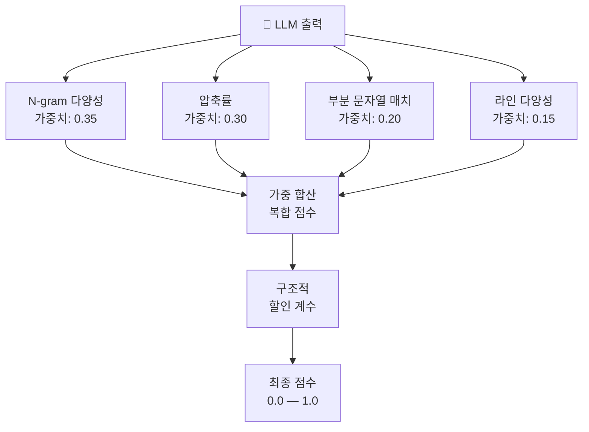

# llm-degen-guard

> [English](README.md)

모델 무관 LLM 출력 퇴화 탐지기 — 4-시그널 복합 점수를 단일 패스로 산출합니다.

## 설치

```bash
pip install llm-degen-guard
```

## 빠른 시작

```python
from degen_guard import DegenGuard

# 배치 검사
report = DegenGuard.check("LLM 출력 텍스트...")
print(report.is_degenerate, report.composite_score)

# 스트리밍 검사
guard = DegenGuard()
for chunk in llm_stream:
    is_degen, score = guard.feed(chunk)
    if is_degen:
        print(f"퇴화 감지! score={score:.2f}")
        break
```

## 동작 원리

4개의 독립 시그널을 하나의 복합 점수(0.0 = 정상, 1.0 = 퇴화)로 결합합니다:

| 시그널 | 가중치 | 측정 대상 |
|--------|--------|----------|
| **N-gram 다양성** | 0.35 | 고유 3-gram 비율 — 낮으면 반복적 |
| **압축률** | 0.30 | zlib 압축 비율 — 높으면 반복적 |
| **부분 문자열 매치** | 0.20 | 윈도우 전반부/후반부 간 정확 중복 |
| **라인 다양성** | 0.15 | 고유 라인 비율 — 중복 라인 = 퇴화 |

구조적 콘텐츠(코드, 목록, 테이블)에는 할인 계수가 적용되어 오탐을 줄입니다.



## 스트리밍 API

```python
guard = DegenGuard(
    window_size=256,       # 분석할 문자 수
    check_interval=64,     # 검사 간 문자 수
    alert_threshold=3,     # 플래그 전 연속 알림 횟수
    score_threshold=0.50,  # 알림 트리거 최소 점수
)

for chunk in llm_stream:
    is_degen, score = guard.feed(chunk)
    if is_degen:
        break

guard.reset()  # 다음 스트림에 재사용
```

## 배치 API

```python
report = DegenGuard.check(full_text)

report.is_degenerate      # bool
report.composite_score    # 0.0 ~ 1.0
report.signals            # tuple of SignalDetail
report.structural_penalty # 코드/테이블 감지 시 < 1.0
report.text_length        # 입력 길이
```

## 왜 이것을 써야 하나?

| 대안 | 한계 | llm-degen-guard |
|------|------|-----------------|
| **Antislop Sampler** | 모델 가중치 접근 필요 (API 미지원) | 출력 텍스트만으로 동작 |
| **SpecRA** | 논문만 존재, 코드 없음 | `pip install` 즉시 사용 |
| **UQLM** | N회 생성 필요 (비용 ×N) | 단일 패스, 실시간 스트리밍 |
| **repetition_penalty** | 프롬프트 토큰에도 적용, 비일관성 유발 | 생성 후 검사, 부작용 없음 |

## 라이선스

MIT
